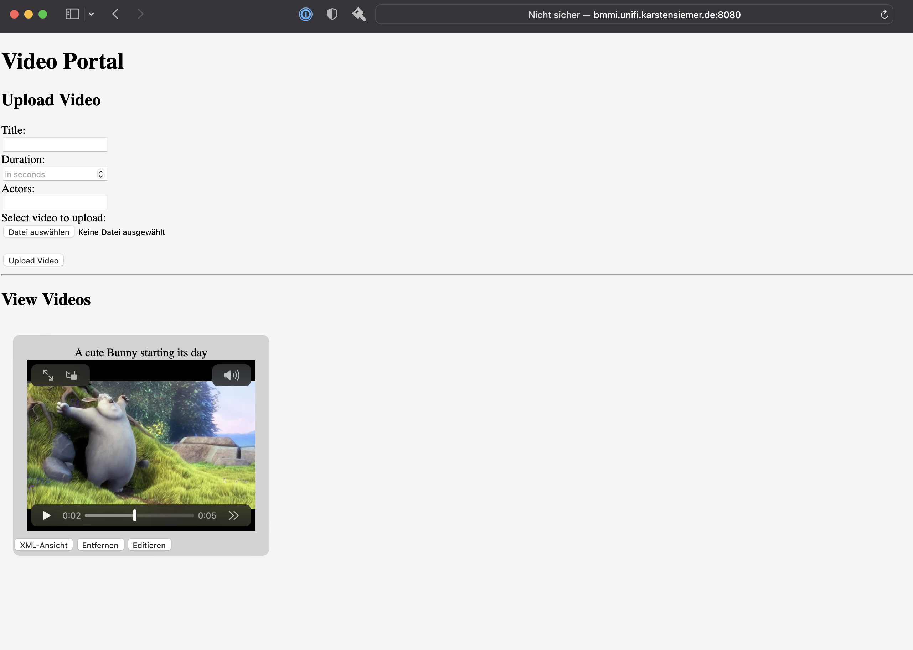

# bmmi

Video Portal

## SetUp

### Git

Die Entwicklung der Aufgabe findet in einem Git-Repo statt welches auf GitHub, gehostet ist.

In dem Repo sind [pre-commit](https://pre-commit.com) hooks installiert, welche ausgeführt werden müssen, bevor ein
Commit der History hinzugefügt werden kann. Dies erlaubt es automatisch Scripte, welche Test- und
Dokumentations-Aufgaben übernehmen, auszuführen.

#### Hooks

- pre-commit-hooks
  - Übernehmen allgemeine Korrekture an Dateien wie Leerzeichen am Ende einer Zeile
- Shellsheck
  - Prüft alle Bash-Scripte auf Fehler
- run-tests
  - Führt das lokale Script run-tests.bash aus
- run-reconcile
  - Führt das lokale Script run-reconcile.bash aus
- Sqlfluff
  - Prüft alle SQL-Statements auf Fehler
- markdownlint
  - Prüft alle Markdown Dateien (wie diese README.md) auf Fehler

### Scripte

- run-compose.bash
  - Übernimmt das starten der [docker-compose](https://docs.docker.com/compose/) Konfiguration
  - Führt das Compose-File in einer [Sops](https://github.com/mozilla/sops) Umgebung aus. Dies ermöglicht es Variablen
    aus einer verschlüsselten Datei (`credentials.yaml`) in die Umgebung von Compose zu injezieren. Dies verhindert
    klartext Passwörter in die Versionsverwaltung abzulegen. Die Verschlüsselung erfolgt mittels eines privaten
    GPG-Keys, welcher _nicht_ diesem Repo hinzugefügt wird, sondern seperat versendet wird.
- run-dump.bash
  - Stellt sicher, dass die lokale MariaDB läuft
  - Erstellt einen Datenbank-Dump und legt diesen lokal ab
  - Die Secrets für die Ausführung wurden bereits von Docker-Compose in die Umgebung des Containers geladen
- run-reconcile.bash
  - Wrapper für `run-dump.bash`
  - Erstellt einen MD5 Hash des aktuellen Dumps
  - Ersetzt den aktuellen Dump mit einem Neuen und erstellt wieder einen MD5 Hash
  - Gibt einen Fehler aus, falls sich der Hash geändert hat
  - Wird als Pre-Commit Hook verwendet, um beim Commit automatisch einen neuen Dump dem Commit hinzuzufügen
  - Dies ermöglicht eine einfache Entwicklung der SPA, da immer ein aktueller Dump dem Repo hinzugefügt wird. Wechselt
    der Entwickler das Arbeitsgerät, kann zu dem aktuellen Commit der Dump geladen werden, um gleich Einträge mit
    Test-Daten zu haben.
- run-restore.bash
  - Verwendet einen lokalen Dump und spielt diesen in die MariaDB der Entwicklungsumgebung ein
- run-tests.bash
  - Wird als Pre-Commit Hook verwendet, um beim Commit Tests der SPA zu automatisieren
  - Tests:
    - php_lint()
      - Sammelt alle `.php` Dateien zusammen und wendet einen `php -l` auf diese an, um diese auf Fehler zu überprüfen
    - php_cs()
      - Übernimmt die Aufgabe statischer Codeanalyse
      - Makiert alle Stellen welche gegen den Coding-Standard verstoßen
      - Korrigiert Verstöße, falls möglich
      - Verwendeter Coding-Standard ist [PEAR](https://pear.php.net/manual/en/standards.php)
    - php_stan()
      - Sucht ohne Unit-Tests nach Bugs und makiert diese
- run-show.bash
  - Wird als schneller shortcut verwendet, um sich den Inhalt der Datenbank anzuschauen
  - Binary Video content wird beim Anzeigen auf 30 Zeichen limitiert
  - Beispiel Output:

```text
+----+------------------------------------------+--------------------------------+-----------------+----------+----------+----------------------+--------------------------------+
| id | title                                    | filename                       | filetype        | filesize | duration | actors               | content                        |
+----+------------------------------------------+--------------------------------+-----------------+----------+----------+----------------------+--------------------------------+
|  1 | Bear eating fish                         | movie.mp4                      | video/mp4       |   318465 |        6 | Some cool bear       |    ftypmp42    mp42isomavc1    |
|  2 | World turning during night               | file_example_MP4_480_1_5MG.mp4 | video/mp4       |  1570024 |       30 | actually the world   |     ftypmp42    mp42mp41isomav |
|  3 | A bunny having a cool day                | sample-mp4-file-medium.mp4     | video/mp4       |  1057149 |       10 | cute bunny           |     ftypisom   isomiso2avc1mp  |
|  4 | Lego movie                               | small.mp4                      | video/mp4       |   383631 |       10 | Lego bricks          |    ftypmp42    mp42isomavc1    |
|  5 | A stream of vehicles passing by the park | sample-15s.mp4                 | video/mp4       | 11916526 |       15 | Some dudes and stuff |     ftypisom   isomiso2avc1mp  |
| 13 | Some girl sitting at the beach           | sample_960x540.mov             | video/quicktime |  1320742 |       13 | literally some girl  |    ftypqt     qt    wide       |
| 14 | Apple ipod teaser                        | 320x240.m4v                    | video/x-m4v     |  2236480 |       75 | Ipod                 |     ftypM4V    M4V M4A mp42is  |
+----+------------------------------------------+--------------------------------+-----------------+----------+----------+----------------------+--------------------------------+
```

### Semantic-Release

Dieses Projekt verwendet [Semantic-Release](https://semantic-release.gitbook.io/semantic-release/) für die
Versionierung.

### Docker-Compose

Dieses Projekt verwendet [docker-compose](https://docs.docker.com/compose/) zur Verwaltung der Umgebung.

Es werden zwei Container verwendet:

- webdevops/php-apache:8.0
  - Dieses Image enthält, unter anderem, folgende Tools, welche für die Entwicklung vonnöten sind:
    - [PHP](https://www.php.net) in der Version 8.0.25
    - [Apache Webserver](https://httpd.apache.org) in der Version 2.4.38
    - [Composer](https://getcomposer.org)
  - Es erlaubt einen schnellen Entwicklungsstart, ohne sich mit langer Konfiguration aufhalten zu müssen
- mariadb:10.10.2
  - Dieses Image enthält MariaDB in der Version 10.10.2

#### Updates

Um die enthaltenden Versionen aktuell zu halten, wird [Renovate](https://www.mend.io/free-developer-tools/renovate/)
empfohlen. Renovate kann über GitHub eingebunden werden und verfügt über Plugins für z. B. Docker-Compose um aktuell
verwendete Versionen zu erkennen und nach neueren zu Suchen und, falls Änderungsbedarf besteht, einen Pull-Request mit
der Aktualisierung zu öffnen.

### DNS

Da es sich um ein lokales Entwicklungsprojekt handelt, welches nicht öffentlich erreichbar sein muss, kann es lokal über
localhost erreicht werden. Als `http` Port wurde `8080` gewählt, da das Binden dieses Ports nicht über erhöhte Rechte
erfolgen muss. Dieser Port wird von lokal an den internen Port `80` des Containers weitergeleitet, um eine
standardisierte Konfiguration des Apache zu ermöglichen. Der ebenfalls konfigurierte Port `8443` kann verwendet werden
um mittels eines Proxys eine verschlüsselte `https` Verbindung zu ermöglichen. Der Proxy inklusive Zertifikat ist jedoch
nicht im Umfang dieses Repos enthalten.

Als Web-Alias-Domain für den Apache ist `bmmi.unifi.karstensiemer.de` konfiguriert. Ein DNS-Record welcher für die
Verwendung eines [letsencrypt](https://letsencrypt.org) Zertifikats vonnöten ist. Der A Record zeigt auf den localhost.

## Lösung der Aufgabe

Alle Dateien sind in dem Ordner `app` abgelegt.

Dieser wird über Docker-Compose in den Container mit dem Web-Server gemounted und über diesen Ausgeliefert.

Der SQL Befehl zum Erstellen der Tabelle ist in `./app/inc/db.sql` abgelegt. Der SQL Befehl ist mittels `CREATE or
REPLACE` definiert, um in der IDE immer den gleichen Befehl zum initialen Anlegen oder Löschen der Tabelle verwenden zu
können. Dies erleichtert die Entwicklung der SPA.

Die `index.html` verwendet nur HTML, CSS und JQuery, welches über AJAX mit der PHP Datenbank-Datei kommuniziert. Dies
gewährleistet eine Single Page Application, welche nicht auf das Neu-Laden der SPA angewiesen ist, um eine Änderung in
der Datenbank dazustellen.

Die SPA ist in einen Upload und einen View bereich geteilt. Mit einer leeren Datenbanktabelle, ist auch das View-Abteil
leer.


### Upload

Füllt man beim Hochladen eines Videos, nicht alle wichtigen Felder aus, bekommt man eine Rückmeldung. Insgesamt wurde
auf viele Möglichkeiten der Input-Validierung verzichtet. Beispielsweise welche Formate verwendet werden dürfen oder
wie lang ein String oder wie groß ein Video sein darf. Die vorhandene Konfiguration sollte einen Video-Upload bis 12MB
zulassen.


Trägt man die Daten korrekt ein und drückt den `upload` button, bekommt man eine Rückmeldung und das Video erscheint
ohne Neuladen auf der SPA.


Drückt man nun auf das Video, wird es abgespielt.



Das interessante hier ist, dass das Video erst geladen wird, wenn es geklickt wird. So können sehr viele Videos in der
SPA angezeigt werden, ohne eine lange Wartezeit beim ersten Laden. Auch hat dies zur Folge, dass nur genau die Videos
heruntergeladen werden, welcher der Client wirklich sehen möchte.

Die JQuery Funktion `gatherVideos` sammelt alle Video-Metadaten zusammen und erzeugt HTML container divs mit HTML Video
tags, wo das `src` tag _noch_ nicht vorhanden ist. Dieses tag wird über das `onplay event` des Videos hinzugefügt,
welches nur getriggert wird, wenn es angeklickt wird. Das Ändern des `src` tags des Videos, löst implizit das Laden
aus. AJAX bekommt nun die Daten des Videos in 1MB Blocken von PHP zugesandt.

Die Vorteile dieses Vorgehens liegen auf der Hand, jedoch hat es auch einige Nachteile. Nach der offiziellen
Dokumentation des Video tags, sollte es eigentlich vom Browser als kaputt markiert werden und ein weiteres Laden
verhindert, da das `src` tag fehlt. Dadurch kann nie das `onplay event` ausgelöst werden und folglich auch `src` tag
nicht nachgereicht werden. Der Browser Chrome geht RFC konform vor und verhindert das Laden eines Videos. Safari und
FireFox erlauben es jedoch trotzdem und der Vorgang wird erfolgreich vollzogen.

Ein weiterer Nachteil ist, dass die Implementation keine Informationen an PHP weitergibt, welcher Block genau geladen
werden soll. PHP übergibt einfach stur nach und nach die Blöcke des ganzen Videos, was dazu führt, dass ein Vorspulen im
Video erst möglich ist, sobald das ganze Video empfangen wurde. Außerdem, muss man warten bis ein Video vollständig
heruntergeladen wurde, bis man das nächste anfangen kann.

Es können nun verschiedene Formate hochgeladen und angezeigt werden. Beispiel Videos können im Ordner `./videos`
gefunden werden.


Falls eine Abkürzung gewünscht ist, kann auch der beigefügte Datenbank-Dump geladen werden mittels:

```bash
./run-restore.bash
```

### XML-Ansicht

Zum Anzeigen der Attribute wurde jedem Container ein Button `XML-Ansicht` spendiert. Es kann angenommen werden, dass
die ursprüngliche Aufgabe die Verwendung von PHP vorgesehen hat um eine vollständige XML-Datei zu generieren.

Dank AJAX befinden wir uns jedoch bereits in einer Schleife wo bereits alle nötigen Daten aus der Datenbank vorhanden
sind. Erst das Klicken des Buttons erzeugt ein XML-Dokument, für welches keine weitere Abfrage der Datenbank vonnöten
ist, die Last der generierung liegt vollständig beim Client und belastet nicht das eigene Backend. Das XML-Dokument,
wird nun in einem HTML und CSS PopUp angezeigt. Hier wurde das erste Video mit dem Bären angeklickt.


Die Korrektheit kann über die Datenbank validiert werden:

```bash
./run-show.bash
+----+------------------------------------------+--------------------------------+-----------------+----------+----------+----------------------+--------------------------------+
| id | title                                    | filename                       | filetype        | filesize | duration | actors               | content                        |
+----+------------------------------------------+--------------------------------+-----------------+----------+----------+----------------------+--------------------------------+
|  1 | Bear eating fish                         | movie.mp4                      | video/mp4       |   318465 |        6 | Some cool bear       |    ftypmp42    mp42isomavc1   |
...
```

### Editieren

Wird der Button `Editieren` gedrückt, wird das Upload-Formular kopiert, die IDs mit dem prefix `edit-` versehen und in
einem PopUp geöffnet.


Hier können nun alle Attribute des Videos verändert werden. Felder, wo nichts eingetragen wird, werden ignoriert und
verbleiben unberührt.

Editieren wir nun den Titel des Videos `Bear eating Fish`.


Wird im Popup der `edit` Knopf gedrückt, lädt sofort die Liste der Videos neu und der geänderte Titel kann betrachtet
werden.

Dabei sollte hier erwähnt werden, dass das Vorgehen im Hintergrund ineffizient designt ist, da immer alle Videos der
Ansicht entfernt und neu hinzugefügt werden. Besser wäre es, wenn ein Abgleich der vorhandenen Videos geschehen würde,
sodass nur Container neu geladen werden, wo es auch wirklich not tut.

### Entfernen

Klickt man den `Entfernen` Knopf eines Videos, wird die Ansicht neu geladen und das Video ist werder im View-Bereich
noch in der Datenbank vorhanden. Hier wurde nun das Video mit der ID `1` bzw. dem geändertem Titel "Average fish enjoyer
Baloo".

Ein Blick in die Datenbank validiert diese Annahme:

```bash
./run-show.bash
+----+------------------------------------------+--------------------------------+-----------------+----------+----------+----------------------+--------------------------------+
| id | title                                    | filename                       | filetype        | filesize | duration | actors               | content                        |
+----+------------------------------------------+--------------------------------+-----------------+----------+----------+----------------------+--------------------------------+
|  2 | World turning during night               | file_example_MP4_480_1_5MG.mp4 | video/mp4       |  1570024 |       30 | actually the world   |     ftypmp42    mp42mp41isomav |
|  3 | A bunny having a cool day                | sample-mp4-file-medium.mp4     | video/mp4       |  1057149 |       10 | cute bunny           |     ftypisom   isomiso2avc1mp  |
|  4 | Lego movie                               | small.mp4                      | video/mp4       |   383631 |       10 | Lego bricks          |    ftypmp42    mp42isomavc1    |
|  5 | A stream of vehicles passing by the park | sample-15s.mp4                 | video/mp4       | 11916526 |       15 | Some dudes and stuff |     ftypisom   isomiso2avc1mp  |
| 13 | Some girl sitting at the beach           | sample_960x540.mov             | video/quicktime |  1320742 |       13 | literally some girl  |    ftypqt     qt    wide       |
| 14 | Apple ipod teaser                        | 320x240.m4v                    | video/x-m4v     |  2236480 |       75 | Ipod                 |     ftypM4V    M4V M4A mp42is  |
+----+------------------------------------------+--------------------------------+-----------------+----------+----------+----------------------+--------------------------------+
```

Für den abschließenden Commit, wurde das Ändern des Titels, sowie dem Löschen des Videos mittels `./run-restore`
rückgängig gemacht.

### Arbeitsflow

Falls ein neuer Entwickler an diesem Projekt arbeiten möchte, muss ein bestehender dessen public GPG-Key von einem
Keyserver abholen, seinem eigenen Keyring hinzufügen und dessen ID in die `.sops.yaml` eintragen.

Nun kann er mittels

```bash
sops updatekeys credentials.yaml
```

die Credentials-Datei neu verschlüsseln, sodass beide auf den unverschlüsselten Inhalt Zugriff haben.

Falls, wie in diesem Fall, eine Übergabe stattfinden soll und es daher nur einen einziger GPG-Key geben kann, muss der
GPG-Key ebenfalls übergeben werden. Dieser muss dann so eingebunden werden, dass sops darauf zugreifen kann.

Falls eine Änderung vorgenommen werden soll oder ein neues Feature hinzugefügt, öffnet der Entwickler einen neuen Branch
in diesem Repo z.B. `feat/add-login`.

Für direktes Anschauen des bisherigen Inhalts startet er das Docker-Compose manifest mit

```bash
./run-compose.bash
```

Die Docker-Container werden gestartet und er kann sich die SPA über seinen Browser anschauen.

Möchte er bereits Test-Daten in die Datenbank laden, um sich Einträge anzuschauen, braucht er nur

```bash
./run-restore.bash
```

ausführen, um einen passenden Datenbankstand zu der bisher geleisteten Arbeit vorzufinden.

Nun fängt er an zu arbeiten bis er gerne einen Test ausführen möchte oder eine Pause machen will.

Dann committet er seine Arbeit mit z.B.

```bash
git commit -s -am "feat(login): add jquery content in todo.html" && git push
```

Nun werden durch den Commit Hooks ausgelöst welche ihm direktes Feedback zu seiner Arbeit liefern. Sind Fehler
vorhanden, welche von den Tests identifiziert werden konnten, schlägt der Commit fehl und sein Fehler wird ihm begründet
angezeigt.

Nun kann er den Commit-Befehl ein weiteres Mal ausführen. Hat er alle Fehler beseitigt, gelingt der Commit. Nimmt er
nach seiner Pause nun die Arbeit wieder auf und erstellt weitere Änderungen, kann er diese an dem Commit mit Anhängen
über

```bash
git commit --am --no-edit -a -s && git push --force-with-lease
```

So muss er sich nicht für jede Änderung eine neue Nachricht ausdenken und die Commits nicht squashen bevor er einen
Pull-Request erstellt, dies erleichtert auch den Review-Prozess. Der `--force-with-lease` stellt sicher, dass der
Remote-Head seines Branches mit dem aktuellen Hash überschrieben werden kann, was für einen Amend vonnöten ist. Jedoch
Commits die von anderen Teilnehmern des Projekts, welche auch an dem gleichen Branch arbeiten, verschont bleiben.

Ist sein Pull-Request erstmal geöffnet, werden die Hooks über die workflows in `.github` ausgeführt und der Reviewer
kann direkt in dem Pull-Request sehen, ob alle Tests erfolgreich ausgeführt werden können.

Wird der Pull-Request gemerged, wird automatisch Semantic-Release im `main` Branch ausgeführt, welcher geleistete
Commit-Messages analysiert und anhand derer, eine neue Versionsnummer festlegt und einen Release durchführt.

#### Falls Verschlüsselung nicht erwünscht ist

Falls Verschlüsselung nicht erwünscht ist, können statt der Umgebungsvariablen auch einfach direkt Passwörter in die
`docker-compose.yml` Datei geschrieben werden und Compose mittels

```bash
docker-compose up -d
```

gestartet werden.

Zu ersetzende Variablen:

- `DATABASE`
  - z.B. mit `bmmi`
- `DATABASE_USER`
  - z.B. mit `bmmi`
- `DATABASE_PASSWORD`
  - z.B. `ichBinEinPasswort`

Dem ist noch hinzuzufügen, dass das Verwenden von Umgebungsvariablen zwar etwas umständlicher ist, jedoch kann so an
mehreren Orten die gleiche Variable verwendet werden, um so das Vergessen einer Änderung zu verhindern, wenn man einen
Wert ändern möchte. Statt in mehreren Zeilen `bmmi` für die Datenbank auf `beispiel` zu ändern, ändert man nur die
Umgebungsvariable und kann keinen fehler mehr machen.
